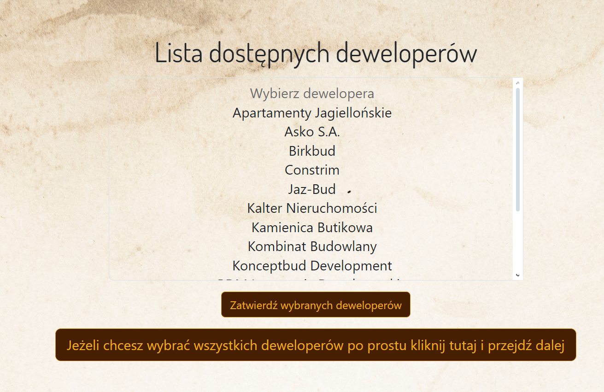
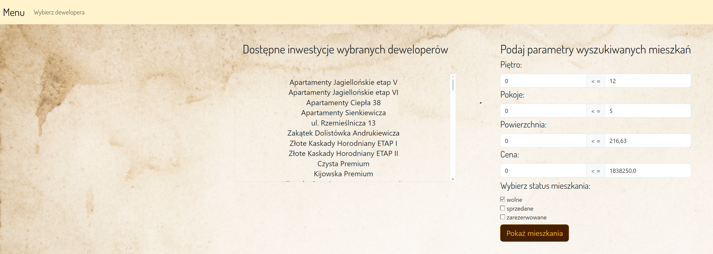
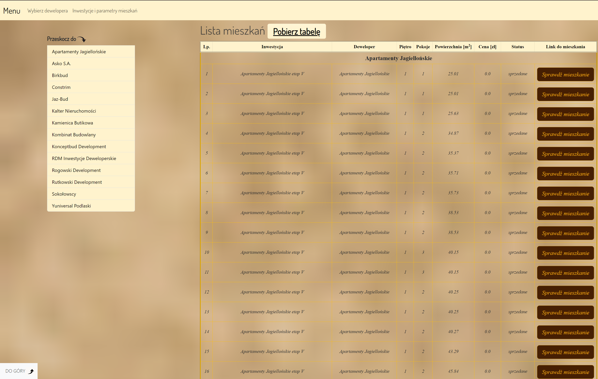
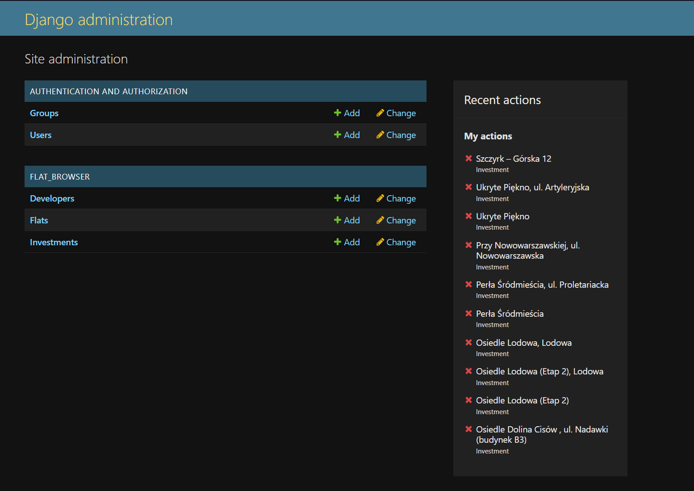
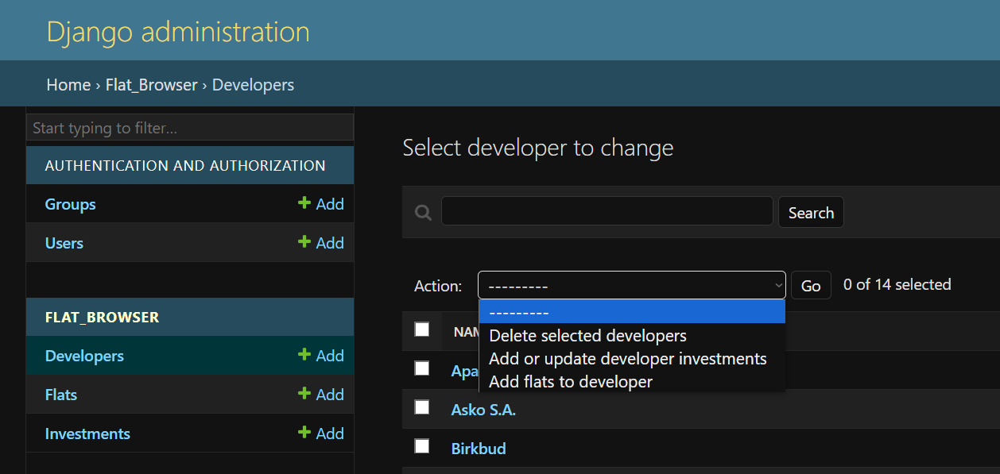
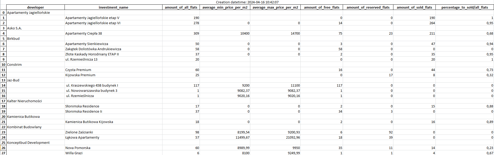

# Developer Scrape App

> Python app scrapes data from websites of the 13 biggest developers placed in city of Bialystok.

## Table of Contents

- [General Info](#general-information)
- [Technologies Used](#technologies-used)
- [Screenshots](#screenshots)
- [Setup](#setup)
- [Features](#features)
- [Project Status](#project-status)
- [Room for Improvement](#room-for-improvement)

## General Information

- The application gathers comprehensive data on all investments and apartments offered by a specific developer in Bialystok. With this information, the app provides details on currently available flats for purchase, as well as those already sold. Users can filter results based on criteria such as price per square meter, availability, and number of rooms.
- My journey into the IT industry began with self-learning Python, aided by various online courses. This application evolved alongside my expanding knowledge.
- The inception of this idea stemmed from a desire to assist my girlfriend at work, where she previously handled these tasks manually.

## Technologies Used

Main techs used in app are:

- Python 3.11
- Django
- BeautifulSoup4
- PostgreSQL
- Docker
- Bootstrap 5.3.0

For production purpose there are also:

- gunicorn
- nginx

All versions you can check in requirement.txt file for [development](https://github.com/owsiej/DeveloperScrapeDjango/blob/main/requirements.txt) and [production](https://github.com/owsiej/DeveloperScrapeDjango/blob/prod/requirements.txt).

## Screenshots






## Setup

Under branch [main](https://github.com/owsiej/DeveloperScrapeDjango) you have development version. To make it run:

- install [Python 3.11](https://www.python.org/downloads/release/python-3110/)
- install [pip](https://pip.pypa.io/en/stable/installation/)
- install all requirements in main dir using

```
$ pip install -r requirements.txt
```

- make .env.dev file and create following environment variables:

  ```
  DEBUG_DEV=1
  SECRET_KEY=
  DJANGO_ALLOW_HOSTS=localhost 127.0.0.1 [::1]

  PGPASSFILE=
  PGSERVICENAME=

  POSTGRES_NAME=
  POSTGRES_USER=
  POSTGRES_PASSWORD=
  POSTGRES_HOST=
  POSTGRES_PORT=
  ```

  SECRET_KEY is a key generated by django. To get one run below command from main dir:

  ```
  $ python manage.py shell -c "from django.core.management.utils import get_random_secret_key; print(get_random_secret_key())"

  ```

  Rest applies to PostgreSQL database. For more info [check django docs.](https://docs.djangoproject.com/en/5.0/ref/databases/#postgresql-notes)

- all you left with is to run appropriate docker commands (make sure you have [docker desktop](https://www.docker.com/products/docker-desktop/) installed and running):

  ```
  $ docker-compose build
  $ docker-compose up
  ```

There is also production version on branch [prod](https://github.com/owsiej/DeveloperScrapeDjango/tree/prod). App used to be hosted on Microsoft Azure using Container registry service but due to high payments I had to remove it. To run this in production you to have to add additional environmental variable `DJANGO_CSRF_TRUSTED_ORIGINS` and change `DEBUG_DEV` to 0. Keep in mind that scrape files on prod branch are not up to date.

## Features

- all scraped data is placed in 3 separate database tables connected using Foreign Key.
- scrapes can be invoked in admin panel 

- at the last endpoint you generate summary in excel file, which consists of amount of all flats(free, reserved, sold) divided by developers investments with min/max average prices for square meters. 

## Project Status

Scrape files on branch main are updated once a month (if needed).

## Room for Improvement

The plan is to refactor all scrape files and transition from BeautifulSoup4 library to the Scrapy/Splash library. Adding more JavaScript to templates is on the table too.
